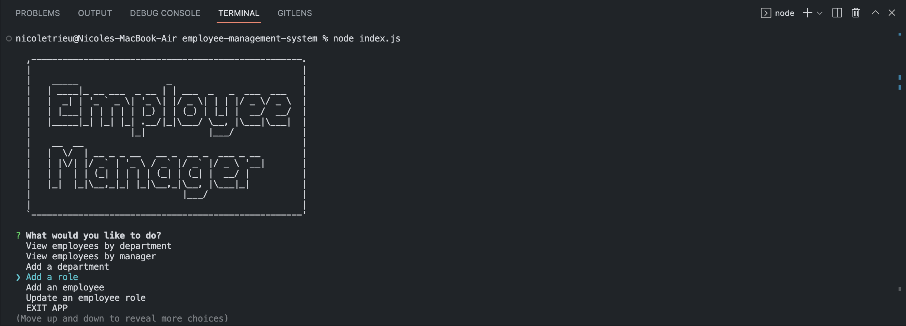
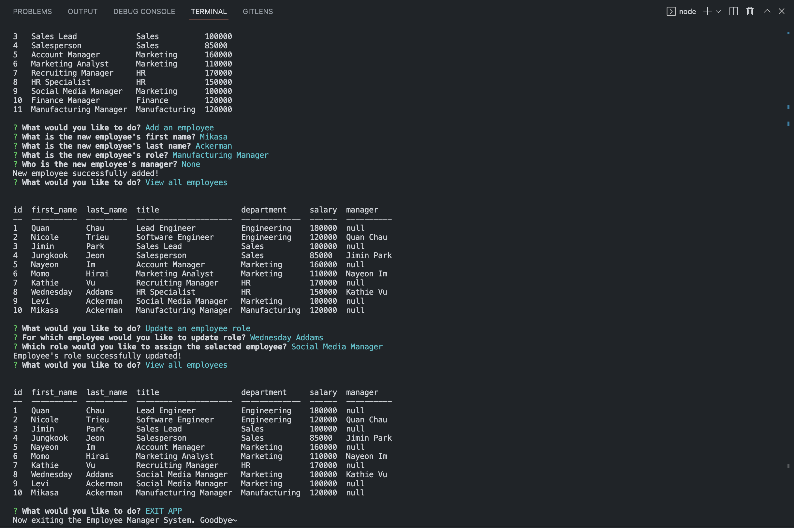

# Employee Manager System
## Description

This command-line application is built to allow companies and non-developers to easily view and interact with information stored in databases about their employees.

## Table of Content

* [Installation](#installation)

* [Usage](#usage)

* [Contributing](#contributing)

* [Questions](#questions)   

## Installation

To install all necessary dependencies for development purposes, please run the command below:  

``npm init -y``  

``npm i``

## Usage

To use this application, simply initialize the npm and install the inquirer package (as instructed above). Then, run node index.js and answer the prompts in the command line interface. Users have the options to: view all departments, view all roles, view all employees, view employees by department, view employees by manager, add a department, add a role, add an employee, and update an employee role. Every time one task is fulfilled, the option menu will reappear for the next task. Once all tasks are completed as needed, users can choose EXIT APP from the menu to quit the application.
 

  

[To preview more features, watch the walkthrough video here.](https://drive.google.com/file/d/1bNU-BB0QsKX9RZIeJjn8QORgiMKZaFuo/view)

## Contributing

There are many ways in which you can participate in this project.
Users can contribute to this repo by submitting bugs and feature requests, reviewing source code changes, and making pull requests for any issues they can find.    

## Questions

For any questions or feedback, please feel free to email me at nbtrieu@uci.edu.
If you would like to check out more of my projects, please visit [nbtrieu](https://github.com/nbtrieu).